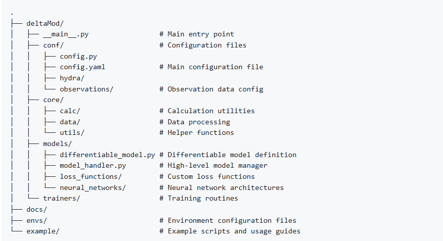

# 𝛿MG: The Generic, Scalable Differentiable PyTorch Modeling Framework

### Summary
𝛿MG is a domain-agnostic, PyTorch-based framework for developing trainable differentiable models that merge neural networks with process-based equations.

The hydroDL2 repository for hydrology models couples with the 𝛿MG framework to enable MHPI-specific hydrologic modeling capabilities. The combination serves both as a benchmark capability for published results (including those that used hydroDL) and an exploratory platform for future hydrology research in MHPI.

Closely synergizes with deep learning tools and the scale advantage of PyTorch. Maintained by the [MHPI group](http://water.engr.psu.edu/shen/) advised by Dr. Chaopeng Shen.

### Key Novelties
- Hybrid Modeling: Skip manually tuning physical model parameters by using neural networks to feed robust and interpretable parameter predictions directly to the model.
  
- Domain-agnostic and Flexible: Extends beyond hydrology to any field or model benefiting from parameter learning, with modularity to meet the diversity of needs along the way.

- Benchmarks: All in one place. 𝛿MG + hydroDL2 will enable rapid deployment and replication of key published MHPI results.

- NextGen-ready: 𝛿MG is designed to be [CSDMS BMI](https://csdms.colorado.edu/wiki/BMI)-compliant, and our differentiable hydrology models in hydroDL2 come with a prebuilt BMI allowing seamless compatibility with [NOAA-OWP](https://water.noaa.gov/about/owp)'s [NextGen National Water Modelling Framework](https://github.com/NOAA-OWP/ngen). Incidentally, this capability also lends to 𝛿MG being easily wrappable for other applications.

### Code Release
Code, with example CAMELS data used for examples and benchmarks:
- [𝛿MG](https://github.com/mhpi/generic_deltaModel)
- [HydroDL 2.0](https://github.com/mhpi/hydroDL2)
- [Example Data](https://onedrive.live.com/login)
