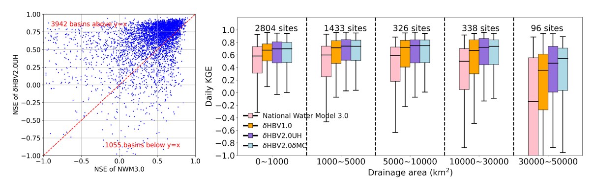

# A continental Hydrologic dataset on seamless MERIT river network and ~180,000 MERIT unit basins

## Preprint paper

Song, Yalan, Tadd Bindas, Chaopeng Shen, Haoyu Ji, Wouter Johannes Maria Knoben, Leo Lonzarich, Martyn P. Clark et al. "High-resolution national-scale water modeling is enhanced by multiscale differentiable physics-informed machine learning." Authorea Preprints (2024). https://doi.org/10.22541/essoar.172736277.74497104/v1
### Results

## Data description

𝛿HBV2_0_continental_data ([zenodo](https://doi.org/10.5281/zenodo.13774373)) is from High-resolution, multiscale, differentiable HBV hydrologic models, 𝛿HBV2.0UH and 𝛿HBV2.0dMC.
𝛿HBV2.0UH is a high-resolution, multiscale model that uses unit hydrograph routing for.
𝛿HBV2.0dMC is a high-resolution, multiscale model that uses external Muskingum-Cunge routing.

The dHBV_streamflow_simulation_gages folder includes 40 years (1980–2020) of streamflow simulations at over 7,000 gage stations from GAGES-II, using both 𝛿HBV2.0UH and 𝛿HBV2.0dMC models. This data is useful for comparison with observations.
The MERIT_flux_states folder includes 40 years (1980–2020) of spatially seamless simulations of hydrologic variables over 180 thousand MERIT unit basins on CONUS from 𝛿HBV2.0UH, including baseflow, evapotranspiration (ET), soil moisture, snow water equivalent, and runoff.
𝛿HBV2.0_MERIT_river_network_simulation folder includes 10 years (1990-1999) of streamflow simulation on seamless MERIT river network by 𝛿HBV2.0dMC.

## Code Release

Code release will come with the paper acceptance.

 

