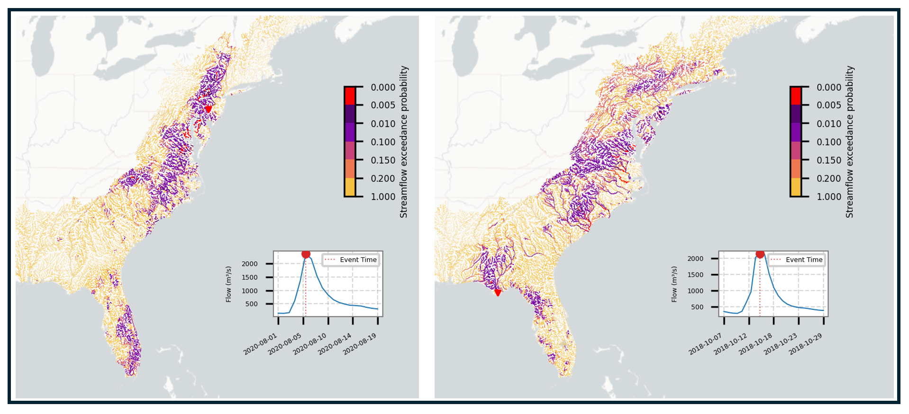

# A 40-year continental Hydrologic dataset on seamless MERIT river network and ~180,000 MERIT unit basins

## Paper

Song, Y., Bindas, T., Shen, C., Ji, H., Knoben, W. J. M., Lonzarich, L., et al. (2025). High‐resolution national‐scale water modeling is enhanced by multiscale differentiable physics‐informed machine learning. Water Resources Research, 61, e2024WR038928. https://doi.org/10.1029/2024WR038928

### Results

## Data description

𝛿HBV2_0_continental_data ([zenodo](https://doi.org/10.5281/zenodo.13774373) and [Colab code](https://colab.research.google.com/drive/1cbO93OMb7z7QUUUxHs39tVF41pIzlPd1#scrollTo=uPiNIUMB5_TO) for data processing) is from High-resolution, multiscale, differentiable HBV hydrologic models, 𝛿HBV2.0UH and 𝛿HBV2.0dMC.
𝛿HBV2.0UH is a high-resolution, multiscale model that uses unit hydrograph routing for.
𝛿HBV2.0dMC is a high-resolution, multiscale model that uses external Muskingum-Cunge routing.

The dHBV_streamflow_simulation_gages folder includes 40 years (1980–2020) of streamflow simulations at over 7,000 gage stations from GAGES-II, using both 𝛿HBV2.0UH and 𝛿HBV2.0dMC models. This data is useful for comparison with observations.
The MERIT_flux_states folder includes 40 years (1980–2020) of spatially seamless simulations of hydrologic variables over 180 thousand MERIT unit basins on CONUS from 𝛿HBV2.0UH, including baseflow, evapotranspiration (ET), soil moisture, snow water equivalent, and runoff.
The dHBV2.0_MERIT_river_network_simulation includes 40 years (1980-2020) of streamflow simulation on seamless MERIT river network by dHBV2.0dMC (New updates!).

## Code Release

The dHBV2.0UH code is available at mhpi/generic_deltaModel: High-resolution differentiable model, 𝛿HBV2.0. https://doi.org/10.5281/zenodo.14827983

 

